# Data Processing Documentation / Datenverarbeitungsdokumentation

## How VoiceFlow Handles Your Data

### 🎤 Audio Processing

```
User speaks → Microphone → Local temporary file → API → Transcription → File deleted
```

**Duration**: Audio files exist for < 5 seconds
**Storage**: RAM only, never written to persistent storage
**Transmission**: Direct HTTPS to your chosen API provider

### 🔐 API Keys Storage

```
User enters key → Encrypted with device keychain → Stored locally
```

**Location**:

- iOS: Keychain Services (encrypted)
- Android: AsyncStorage (device-encrypted)
  **Access**: Only this app on your device

### 📝 Text Processing

```
Your text → Direct API call → Response → Displayed
```

**Storage**: Only in app memory during session
**History**: Optional, stored locally, can be cleared anytime

### 🌐 Network Connections

The app ONLY connects to:

1. **Your configured API endpoints**:
   - OpenAI: api.openai.com
   - Google: generativelanguage.googleapis.com
   - Anthropic: api.anthropic.com

2. **No other connections** - No analytics, no tracking, no ads

### 📊 Data Flow Diagram

```mermaid
graph LR
    A[Your Device] -->|Your API Key| B[API Provider]
    B -->|Response| A
    A -->|Never| C[Our Servers ❌]
    A -->|Never| D[Analytics ❌]
    A -->|Never| E[Third Parties ❌]
```



### 🔍 What Each Provider Sees

When you use an API provider, they receive:

- The text/audio you send
- Your API key
- Standard HTTPS headers (IP, user agent)

They do NOT receive:

- Your name or email (unless in the content)
- Device ID
- Location
- Any other app data

### 🗑️ Data Deletion

**To delete all app data:**

1. Settings → Clear All Data
2. Or: Delete the app

**What gets deleted:**

- All API keys
- All history
- All settings
- Everything - the app resets completely

### 🇪🇺 GDPR Compliance

As a user, you have full control:

- **Right to Access**: All data is already on your device
- **Right to Deletion**: Clear button in settings
- **Right to Portability**: Export your history anytime
- **Right to Rectification**: Edit any stored data
- **No Profiling**: We don't analyze or profile you

### 🔒 Security Measures

1. **Encryption at Rest**: API keys encrypted
2. **Encryption in Transit**: HTTPS only
3. **No Backend**: No servers to hack
4. **Open Source**: Code is auditable
5. **Minimal Permissions**: Only microphone when needed

### 📱 Platform-Specific Details

**iOS:**

- Audio: AVAudioSession (temporary)
- Storage: UserDefaults + Keychain
- Network: URLSession

**Android:**

- Audio: MediaRecorder (temporary)
- Storage: AsyncStorage + KeyStore
- Network: OkHttp

### ⚖️ Legal Basis (GDPR Article 6)

Processing is based on:

- **Consent**: You explicitly provide API keys
- **Contract**: Necessary to provide the service you requested
- **Legitimate Interest**: Local processing for functionality

### 📞 Data Protection Contact

For any data protection questions:

- Create an issue: https://github.com/AndreasKalkusinski/VoiceFlow/issues
- Email: [Provided in App Store listing]

### 🌍 International Transfers

When using US-based APIs (OpenAI, Anthropic):

- Data is sent directly to US servers
- You acknowledge this transfer
- Review provider's privacy shield/SCC status

---

_This documentation is part of our commitment to transparency. The app is open source - verify these claims yourself in our code._
