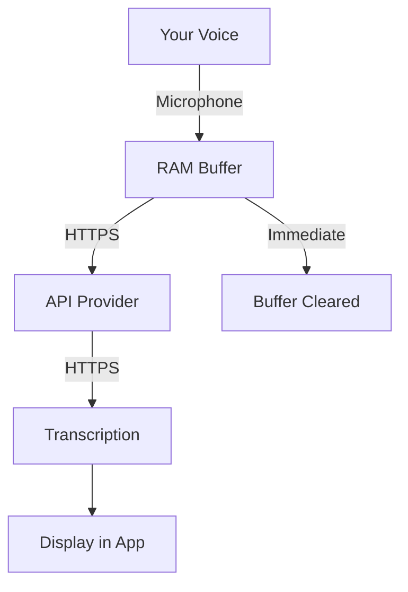

# Privacy and Security

VoiceFlow is built with privacy as the foundation. This page explains how we protect your data and what security measures are in place.

## 🔒 Core Privacy Principles

### 1. **No Data Collection**

- ❌ We don't collect ANY user data
- ❌ No analytics or tracking
- ❌ No crash reporting with personal info
- ❌ No usage statistics
- ❌ No backend servers

### 2. **Local-First Architecture**

```
Your Device ←→ Your API Provider
     ↓
   No middleman servers
```

### 3. **You Own Your Data**

- All data stays on your device
- You can delete everything anytime
- No account or registration required
- Complete data portability

## 🛡️ Security Implementation

### API Key Storage

#### iOS

- Stored in **iOS Keychain**
- Hardware-encrypted
- Biometric protection available
- Sandboxed from other apps

#### Android

- Stored in **Android Keystore**
- Hardware-backed encryption
- Protected by device lock
- App-specific storage

### Audio Processing

```
1. Recording starts → Temporary RAM buffer
2. Recording stops → Direct API upload
3. API response → Buffer cleared
4. Total time in memory: < 5 seconds
```

**Never stored on disk** ✅

### Network Security

- ✅ HTTPS only connections
- ✅ TLS 1.3 where supported
- ✅ Certificate validation
- ✅ No custom certificates

## 📊 Data Flow Transparency

### What happens when you transcribe speech:



### What your API provider sees:

- ✅ Audio/text you send
- ✅ Your API key
- ✅ Standard HTTPS headers

### What they DON'T see:

- ❌ Your name or email
- ❌ Device identifier
- ❌ Location
- ❌ Other app data

## 🔐 Security Best Practices

### For Users

#### Protect Your API Keys

- Don't share screenshots with keys visible
- Regenerate if exposed
- Use different keys for different apps

#### Device Security

- Use strong device passcode/biometrics
- Keep OS updated
- Don't jailbreak/root device

#### Network Safety

- Avoid public WiFi for sensitive content
- Use VPN if needed
- Check HTTPS in provider dashboards

### For Developers

#### Never Log Sensitive Data

```typescript
// ❌ BAD
console.log(`API Key: ${apiKey}`);

// ✅ GOOD
console.log('API call initiated');
```

#### Validate All Inputs

```typescript
// Always sanitize before API calls
const sanitized = text.trim().substring(0, MAX_LENGTH);
```

## 🚨 Threat Model

### What we protect against:

- ✅ Data breaches (no server to breach)
- ✅ Mass surveillance (no central collection)
- ✅ Data sales (no data to sell)
- ✅ Profile building (no analytics)

### What you must protect:

- ⚠️ Device physical access
- ⚠️ API key exposure
- ⚠️ Malicious app modifications
- ⚠️ Network interception (use HTTPS)

## 🔍 Auditing & Verification

### Open Source Benefits

- **Full code transparency**: Review our [GitHub](https://github.com/AndreasKalkusinski/VoiceFlow)
- **Community auditing**: Anyone can verify claims
- **No hidden behavior**: What you see is what runs

### Verify Our Claims

1. Check network traffic with proxy tools
2. Review source code
3. Monitor file system access
4. Inspect API calls

## 📱 Platform-Specific Privacy

### iOS Privacy

- App Tracking Transparency: Not applicable (no tracking)
- Privacy Nutrition Label: Minimal data types
- Sandbox: Complete isolation
- Permissions: Microphone only

### Android Privacy

- Data Safety Section: No data collected
- Permissions: RECORD_AUDIO only
- Storage: App-specific directories
- Google Play Protect: Compatible

## 🌍 Compliance

### GDPR (Europe)

- ✅ No personal data processing
- ✅ No data controller relationship
- ✅ User has full control
- ✅ Right to deletion (delete app)

### CCPA (California)

- ✅ No data sale
- ✅ No data collection
- ✅ Full user control
- ✅ Transparent practices

### COPPA (Children)

- ⚠️ App not designed for children < 13
- No data collection regardless of age

## 🔄 Data Lifecycle

### Session Data

```
Created → Used → Destroyed
   ↓        ↓        ↓
On demand  In RAM  On completion
```

### Persistent Data

- **Settings**: Stored locally, encrypted
- **History**: Optional, local only, deletable
- **API Keys**: Keychain/Keystore, encrypted

## 🚮 Data Deletion

### Delete Everything:

1. Settings → Clear All Data
2. Or: Delete the app

### What gets removed:

- ✅ All API keys
- ✅ All settings
- ✅ All history
- ✅ All cached data
- ✅ Everything

## 🆘 Security Incidents

### If API key is compromised:

1. Immediately regenerate key in provider dashboard
2. Update key in VoiceFlow
3. Review provider's API usage logs
4. Contact provider if suspicious activity

### Reporting Security Issues:

- Use [GitHub Security Advisory](https://github.com/AndreasKalkusinski/VoiceFlow/security)
- Don't post publicly
- Include details for reproduction

## 📋 Privacy Checklist

### Before using VoiceFlow:

- [ ] Understand your API provider's privacy policy
- [ ] Set up device security (passcode/biometric)
- [ ] Review data retention needs
- [ ] Consider content sensitivity

### Regular maintenance:

- [ ] Review API usage monthly
- [ ] Rotate API keys periodically
- [ ] Clear history if not needed
- [ ] Update app for security patches

## 🔗 Related Documents

- [Privacy Policy](https://github.com/AndreasKalkusinski/VoiceFlow/blob/main/docs/PRIVACY.md)
- [Security Policy](https://github.com/AndreasKalkusinski/VoiceFlow/blob/main/SECURITY.md)
- [Data Processing Details](https://github.com/AndreasKalkusinski/VoiceFlow/blob/main/docs/DATA_PROCESSING.md)

## 💬 Questions?

Privacy concerns? Ask in:

- [GitHub Discussions](https://github.com/AndreasKalkusinski/VoiceFlow/discussions)
- [Security Issues](https://github.com/AndreasKalkusinski/VoiceFlow/security/advisories)

---

_Your privacy is not a feature, it's the foundation._
